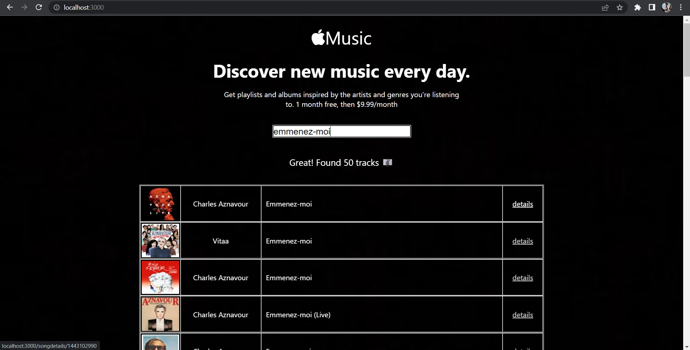

# MY WEBSITES WITH PUBLIC URLs

Here are the Websites I have developed and deployed on firebase server.

## 01. ITUNES MUSIC SEARCHER

This is a little copy of apple music website where you can search songs, see the singer's name and image, click on the details link and see the song details, listen to a part of the song, see the price, duration, country and other details about the song.

[Go to WEBSITE of iTunes music searcher simple clone](https://itunes-simple-clone-a7486.web.app/)
[Go to GITHUB REPO of iTunes music searcher simple clone](https://github.com/AvetBadalyan/iTunes-music-Searcher)
