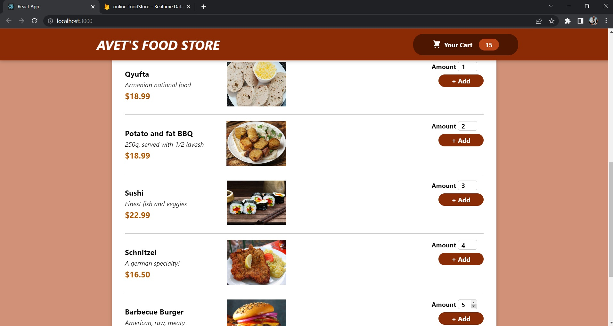
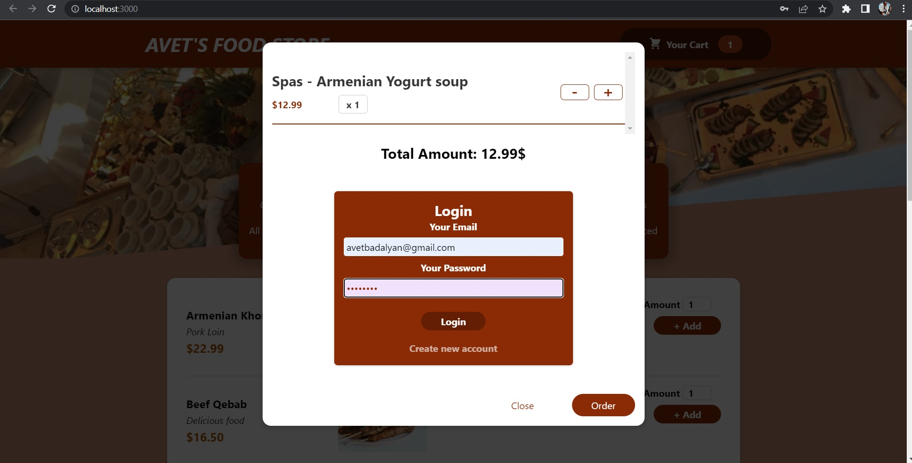
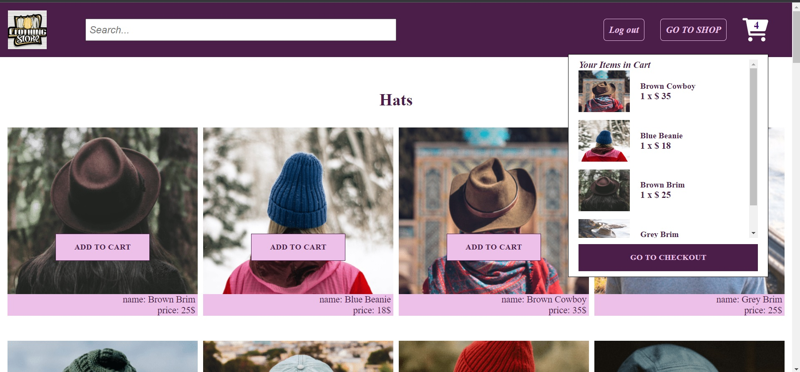
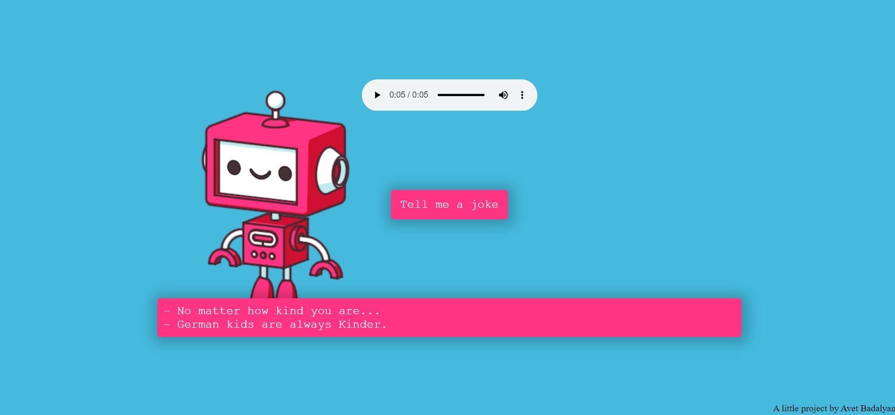
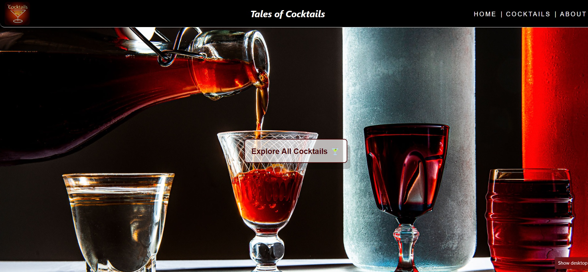
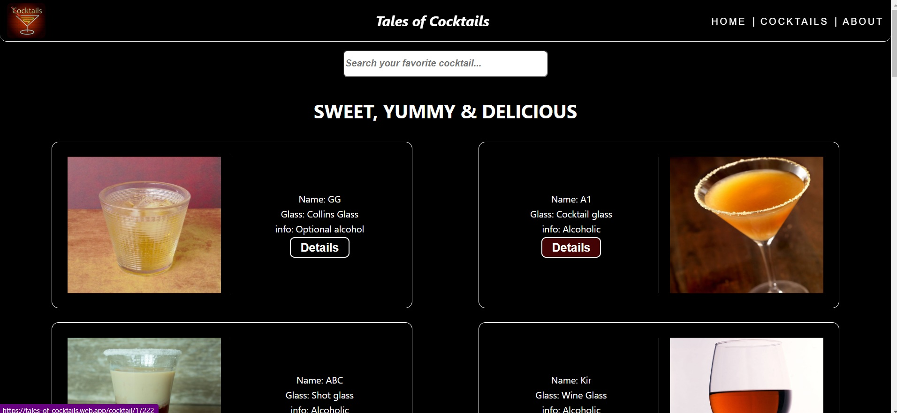
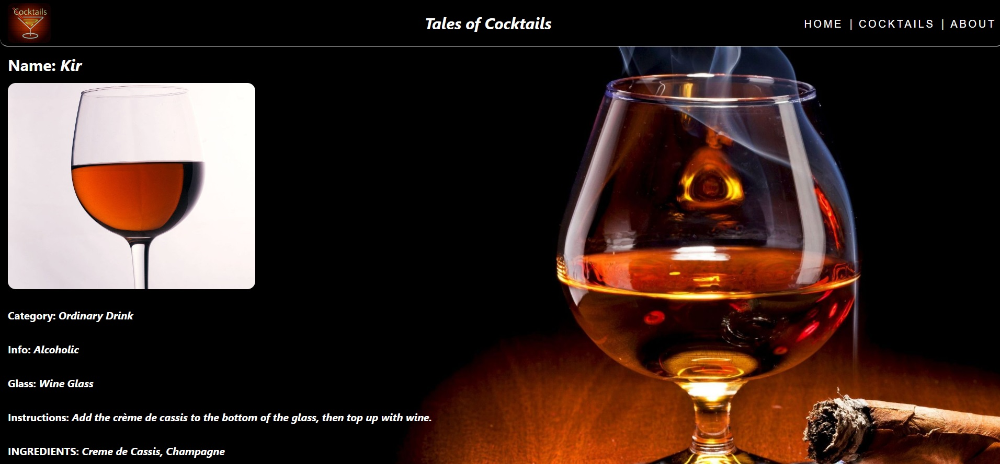

# MY WEBSITES WITH PUBLIC URLs

# Hey Guys! I am excited to share with you the Websites I have developed and deployed on firebase server, so that you can just click on the link and go to the site, have fun with reactive apps and evaluate my first steps in IT and Web. I will update this Portfolio periodically and regularly. Thank you for looking through it :)

## 01. AVET'S ONLINE FOOD STORE

This is an online food store with a nice styling and principal functions - view meals menu with meal name, price and description, click on add button to add the meal to the cart, control the amount of chosen item, add or remove items to/from the cart. Also Authentication with Firebase - Sign up and login, make an order, send order data to server, get confirmation about receiving the order.

[Go to WEBSITE of Online Food Store](https://online-foodstore.web.app/)  
[Go to GITHUB REPO of Online Food Store](https://github.com/AvetBadalyan/Online-Food-Store)

## 02. ONLINE CLOTHES SHOP

ONLINE CLOTHES SHOP CREATED WITH REACT REDUX (includes Responsive & Adaptive design both for Web and Tablets and Mobile)

This is an online clothes store with principal functions - view items menu with each item's name, price and description, click on add button to add the product to the cart, control the amount of chosen item, add or remove items to/from the cart. Also Authentication with Firebase - Sign up and login

[Go to WEBSITE of Online Clothes Shop](https://avet-clothes-shop-f8267.web.app/)  
[Go to GITHUB REPO of Online Clothes Shop](https://github.com/AvetBadalyan/Avet-Clothes-shop-with-Redux)

## 03. Todo list with Redux toolkit

This is an app due to which you can add your tasks to complete with dates, collect them in some special day and look them daily, edit already written task if you want to, also delete some or all of them, strike with line-through the completed ones by checking the box, clear all completed ones and so on.
With Mobile adaptation and responsive design!
This is some kind of exercise and practice of Redux Toolkit for me as a developer.

[Go to WEBSITE of Todo list with Redux toolkit](https://todo-list-with-redux-toolkit.web.app/)  
[Go to GITHUB REPO of Todo list with Redux toolkit](https://github.com/AvetBadalyan/Todo-list-with-date-redux-toolkit)

## 04. ITUNES MUSIC SEARCHER

This is a little copy of apple music website where you can search songs, see the singer's name and image, click on the details link and see the song details, listen to a part of the song, see the price, duration, country and other details about the song.

[Go to WEBSITE of iTunes music searcher simple clone](https://itunes-simple-clone-a7486.web.app/)  
[Go to GITHUB REPO of iTunes music searcher simple clone](https://github.com/AvetBadalyan/iTunes-music-Searcher)

## 05. Joke Teller (Pure HTML/CSS, JS)

This is a little app to click on the button and listen to a joke with subtitles.
(used Text to speech engine with JavaScript SDK)
With Mobile adaptation

[Go to WEBSITE of Joke Teller](https://get-joke-f9568.web.app/)  
[Go to GITHUB REPO of Joke Teller](https://github.com/AvetBadalyan/Joke-Teller-with-Text-to-Speech)

## 06. Quotes Generator (Pure HTML/CSS, JS)

HERE IS A QUOTE GENERATOR! (a little app with Pure HTML/CSS and JS, Web and mobile responsive - data fetching and random generating)

Click on "New Quote" button and read a new one!

[Go to WEBSITE of QUOTE GENERATOR](https://quote-generator-c7fdb.web.app/).  
[Go to GITHUB REPO of QUOTE GENERATOR](https://github.com/AvetBadalyan/Quote-Generator-Pure-HTML-CSS-JS)

## 07. PICTURE IN PICTURE MODE OF YOUTUBE (Pure HTML/CSS, JS)

You click on button and you can see the video playing when you navigate from site to site

Link to Description - [https://css-tricks.com/an-introduction-to-the-picture-in-picture-web-api/](https://css-tricks.com/an-introduction-to-the-picture-in-picture-web-api/).

[Go to WEBSITE of PICTURE IN PICTURE MODE](https://picture-in-picture-mode.web.app/).  
[Go to GITHUB REPO of PICTURE IN PICTURE MODE](https://github.com/AvetBadalyan/Picture-in-Picture-mode)

## 08. Tales of Cocktails with Redux Toolkit

This is a little app with dynamic routing built with Redux Toolkit.
You can see the whole collection of cocktails, search a single one, see details of a specific cocktail in another page.
With Mobile Adaptation and Responsive design.

[Go to WEBSITE of Tales of Cocktails](https://tales-of-cocktails.web.app/).  
[Go to GITHUB REPO of Tales of Cocktails](https://github.com/AvetBadalyan/Tales-of-Cocktails-Redux-Toolkit)
